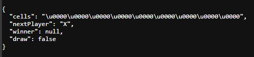

# Parcial Práctico 2 tercio
## Sebastian Galvis Briceño

Lo primero es construir el juego Tic Tac Toe, en la entrega inicial, se entregó el backend funcional para el juego TicTacToe.

Con el objetivo de mantener el desarollo del front end y back end por separado, se ha creado el repositorio dedicado al front end en [este enlace](https://github.com/sebRedi/TicTacToeARSWFront).

Ahora iremos cumpliendo uno a uno los requisitos de entrega:
1. Crear una sala
2. Entrar a una sala
3. Jugar a dos jugadores en forma interactiva una partida de Tic Tac Toe
4. El sistema debe persistir las salas y el estado de Juego a una base de datos.
5. El sistema debe permitir retroceder en la historia en cada sala. Una sala recuperada de la base de datos debe traer sus historia y permitir por ejemplo retroceder en el juego normalmente.

